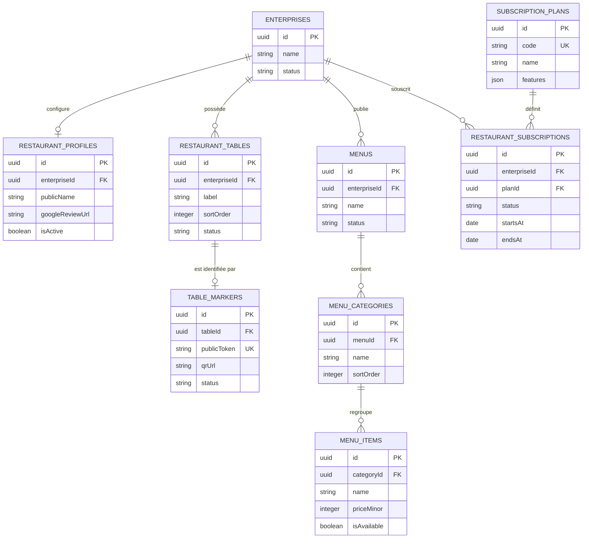

# Maze-NFC — architecture du module Restau

## Objectif

Le module Restau fournit une expérience web mobile-first accessible depuis une table connectée : menu digital sans compte client, puis réservation, commande et paiement selon le palier du restaurant.

Le périmètre de cette première journée est le cadrage technique et le modèle de données. Les écrans et les flux métier seront implémentés par étapes dans les prochains jours.

## Architecture cible

```text
Client (smartphone)
  └─ tap carte connectée / scan QR
      └─ Frontend React + Vite (interface publique, sans compte)
          └─ API Express
              └─ PostgreSQL via Sequelize

Restaurateur / équipe Leaddy
  └─ Frontend React + Vite (espace authentifié)
      └─ API Express + contrôle du tenant enterpriseId
```

Le produit reste 100 % web : aucune application native n'est prévue dans la v1. Le QR code est le fallback universel ; il pointe vers la même URL publique que la carte connectée.

### Décisions d'intégration avec l'existant

- `enterprises` reste le tenant et le compte du restaurateur. Un restaurant Restau est identifié par `enterpriseId` afin de réutiliser l'authentification et les rôles déjà présents.
- Les nouvelles tables Restau utilisent `enterpriseId` comme clé d'isolation obligatoire.
- Les modèles et migrations Sequelize restent la source de vérité du schéma PostgreSQL.
- Le frontend public ne reçoit jamais de données d'un autre restaurant : l'URL publique résout un marqueur actif, puis le backend charge uniquement le menu du tenant associé.
- Le terme technique « NFC » reste interne au code et à l'administration. Les libellés clients utilisent « carte connectée » et « table connectée ».

## Modèle de données v1



### Entités et règles principales

| Entité | Rôle | Règles v1 |
| --- | --- | --- |
| `restaurant_profiles` | Informations spécifiques au restaurant | 0 ou 1 profil par `enterpriseId` |
| `restaurant_tables` | Tables physiques du restaurant | `label` unique dans un restaurant ; statuts `active`, `inactive` |
| `table_markers` | Identifiant public de la table et URL QR | un marqueur actif maximum par table ; `publicToken` unique et non devinable |
| `menus` | Menu d'un restaurant | un menu publié maximum en v1 ; statuts `draft`, `published`, `archived` |
| `menu_categories` | Catégories du menu | ordre d'affichage par `sortOrder` |
| `menu_items` | Plats affichés au client | prix entier en unité mineure ; disponibilité indépendante de la publication |
| `subscription_plans` | Offre d'appel, Standard, Premium | les fonctionnalités sont pilotées par `features` |
| `restaurant_subscriptions` | Abonnement courant et historique | une seule souscription active par restaurant |

### Entités à prévoir après le socle

Les commandes, lignes de commande, paiements et événements de scan seront ajoutés après la validation du socle menu. Les réservations sont désormais modélisées dans `restaurant_reservations` et portent `enterpriseId` pour garantir l'isolation et le suivi côté restaurateur. Le lien d'avis Google est stocké sur le tenant restaurant et exposé uniquement comme action publique.

## Flux publics

1. Le client tape la carte connectée ou scanne le QR code.
2. Le frontend appelle l'API avec le `publicToken`.
3. L'API vérifie que le marqueur et la table sont actifs, puis renvoie le menu publié du restaurant.
4. Le client consulte le menu sans créer de compte.
5. Les actions réservation, panier, commande et paiement sont activées uniquement si le palier autorise la fonctionnalité.

## API cible du socle

Les routes seront ajoutées progressivement, avec le préfixe `/api/restau` :

- `GET /api/restau/public/menu/:enterpriseId` — lecture publique v1 du menu publié ; le remplacement par un `publicToken` de table connectée est prévu avec la tâche QR/NFC ;
- `GET /api/restau/menus` — menus du restaurateur authentifié ;
- `POST|PATCH|DELETE /api/restau/menus/...` — gestion du menu côté dashboard ;
- `GET|POST|PATCH /api/restau/tables/...` — gestion des tables et marqueurs ;
- `GET /api/restau/subscription` — palier et fonctionnalités actives.

Les routes publiques ne doivent accepter que le token public. Les routes dashboard doivent utiliser le middleware d'authentification existant et vérifier systématiquement le rôle et `enterpriseId`.

## Contraintes techniques retenues

- PostgreSQL + Sequelize, UUID pour les identifiants ;
- montants monétaires stockés en entier (`priceMinor`) et jamais en flottant ;
- timestamps `createdAt` et `updatedAt` sur toutes les nouvelles tables ;
- index sur `enterpriseId`, `publicToken`, les statuts et les colonnes de recherche publique ;
- aucune modification du schéma au démarrage de l'API : les évolutions passent par une migration ;
- menu client responsive et rapide, sans authentification obligatoire ;
- compatibilité Android/Chrome et iOS/Safari via URL web, QR en solution de secours.
